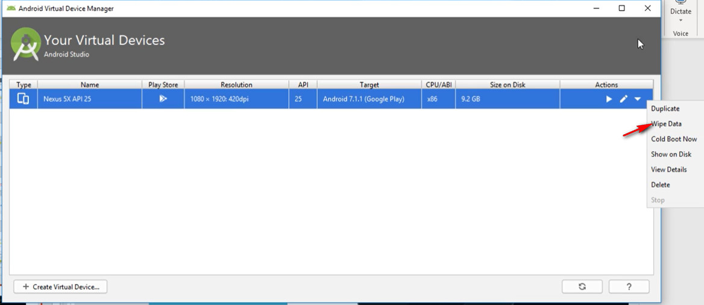
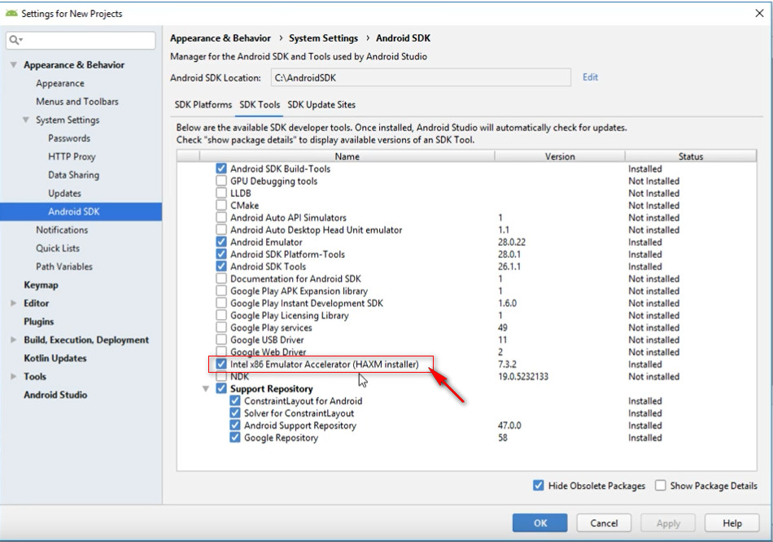
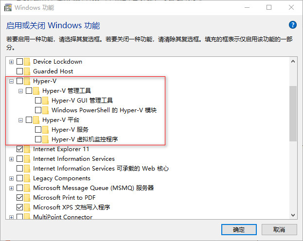

# Setup Appium

## Emulator vs Simulator

[Read this article.][Emulator vs Simulator]

[Emulator vs Simulator]: http://www.differencebetween.net/technology/differences-between-android-emulator-and-simulator/

## Android Studio and Android SDK

Create below environment variables:

- `ANDROID_SDK_HOME`: /path/to/avd-home
- `ANDROID_HOME`: /path/to/android-sdk-home

Add `tools`, `build-tools`, `platform-tools` under `ANDROID_HOME` to `PATH` variable.

### ADB Commands

```bash
adb start-server
adb kill-server
adb devices
```

Find current running app's package name and activity name:

```shell
adb shell "dumpsys activity activities | grep ResumedActivity"
```

Look for output like this:

```text
mResumedActivity: ActivityRecord{bdf9350 u0 com.google.android.apps.messaging/.ui.ConversationListActivity
```

The package name is **com.google.android.apps.messaging**.

The activity name is **com.google.android.apps.messaging.ui.ConversationListActivity**.

Or you can search `appActivity` from Appium server log like this:

```text
"appActivity":"com.google.android.apps.messaging.ui.ConversationListActivity","appPackage":"com.google.android.apps.messaging"
```

### Trouble Shooting

If there is no device listed when you run `adb devices`, go to **Android Virtual Device Manager > Select a Device > Wipe Data**



If you get this error in the **Event Log**:

```text
Emulator: emulator: ERROR: x86 emulation currently requires hardware acceleration
```

Go to **SDK manager** and select **emulator-accelerator**:



Go to *\<android-sdk\>\extras\intel\Hardware_Accelerated_Execution_Manager* and install *intelhaxm-android.exe*

If you get this error:

```text
This computer does not support Intel Virtualization Technology (VT-x) or it is being exclusively used by Hyper-V. HAXM cannot be installed.
Please ensure Hyper-V is disabled in Windows Features, or refer to the Intel HAXM documentation for more information.
```

Disable Hyper-V and restart your computer:



## Appium Desktop

Appium Desired Capabilities:

```json
{
    "deviceName": "Android Emulator",
    "platformName": "Android",
    "appPackage": "com.google.android.apps.messaging",
    "appActivity": "com.google.android.apps.messaging.ui.ConversationListActivity"
}
```

## Install Python Client

```shell
pip install Appium-Python-Client
```

## Default Message App

package name: `com.google.android.apps.messaging`

## Features to implement

- What's the difference of id, resource-id and content-desc.
- Parent and child elements
- Locate elements
- Press key code
- Capture screen
- Record screen
- How to confirm a popup
- TouchAction
- Gestures
- Start Appium server with NPM on slave machine
