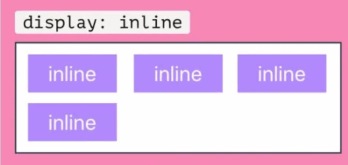
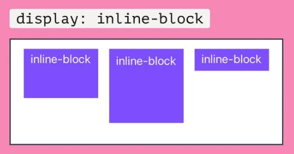
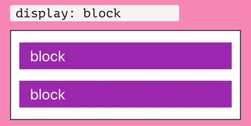
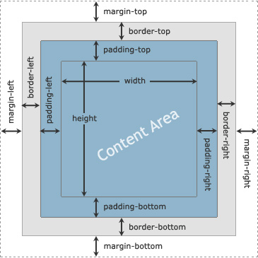
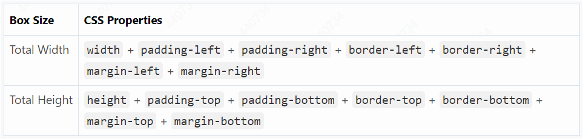
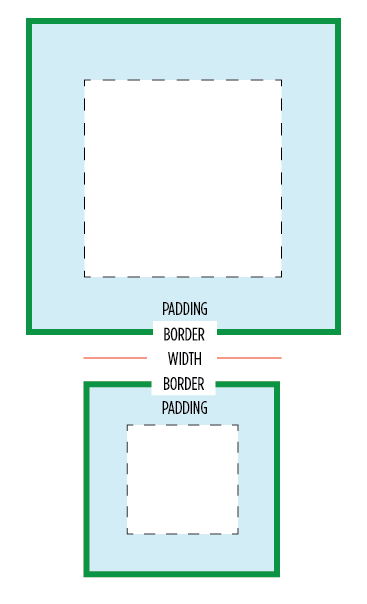
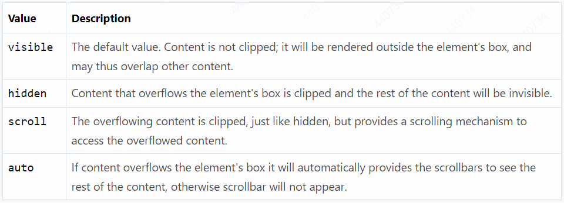
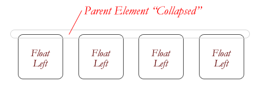
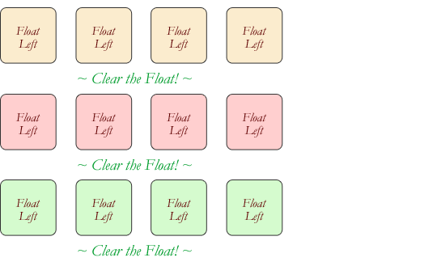

# CSS Tutorial

## Useful Websites

- <https://css-tricks.com/>

## Including CSS in HTML Documents

- **Inline styles** — Using the style attribute in the HTML start tag.
- **Embedded styles** — Using the `<style>` element in the head section of a document.
- **External style sheets** — Using the `<link>` element, pointing to an external CSS file either by linking and importing.

Priority: inline > embedded > external

## CSS Syntax

A CSS rule have two main parts, a selector and one or more declarations:


## Comments in CSS

A CSS comment begins with `/*`, and ends with `*/`, as shown in the example below:

```css
/* This is a CSS comment */
h1 {
    color: blue;
    text-align: center;
}
```

## Case Sensitivity in CSS

CSS property names and many values are not case-sensitive. Whereas, CSS selectors are usually case-sensitive, for instance, the class selector `.maincontent` is not the same as `.mainContent`.

You should assume that all components of CSS rules are case-sensitive.

## CSS Selectors

A CSS selector is a pattern to match the elements on a web page. The style rules associated with that selector will be applied to the elements that match the selector pattern.

### Universal Selector

The style rules inside the `*` selector will be applied to every element in a document.

```css
* {
    margin: 0;
    padding: 0;
}
```

### Element Type Selectors

An element type selector matches all instance of the element in the document with the corresponding element type name regardless of their position in the document tree.

```css
p {
    color: blue;
}
```

### Id Selectors

The id selector is defined with a hash sign (`#`) immediately followed by the id value to define style rules for a *single* or *unique* element.

```css
#error {
    color: red;
}
```

### Class Selectors

The class selector is defined with a period sign (`.`) immediately followed by the class value.

```css
.blue {
    color: blue;
}

p.blue {
    color: blue;
}
```

### Descendant Selectors

You can use these selectors when you need to select an element that is the descendant of another element.

```css
ul.menu li a {
    text-decoration: none;
}
h1 em {
    color: green;
}
```

### Child Selectors

A child selector is used to select only those elements that are the direct children of some element.

```css
ul > li {
    list-style: square;
}
ul > li ol {
    list-style: none;
}
```

### Adjacent Sibling Selectors

The adjacent sibling selectors can be used to select sibling elements (i.e. elements at the same level). This selector has the syntax like: E1 + E2, where **E2** is the target of the selector. That means only those paragraphs that come immediately after each `<h1>` heading will have the associated style rules.

```css
h1 + p {
    color: blue;
    font-size: 18px;
}
```

### General Sibling Selectors

The general sibling selector is similar to the adjacent sibling selector (E1 + E2), but it is less strict. A general sibling selector is made up of two simple selectors separated by the tilde (`∼`) character. It can be written like: E1 ∼ E2, where **E2** is the target of the selector.

```css
h1 ∼ p {
    color: blue;
    font-size: 18px;
}
```

## Attribute Selectors

### CSS `[attribute]` Selector

To style all the elements that have a `title` attribute:

```css
[title] {
    color: blue;
}
```

To match only `<abbr>` elements that has a `title` attribute:

```css
abbr[title] {
    color: red;
}
```

### CSS `[attribute="value"]` Selector

To match all `<input>` elements that has a type attribute with a value equal to submit.

```css
input[type="submit"] {
    border: 1px solid green;
}
```

### CSS `[attribute~="value"]` Selector

To match all the elements with value is a list of space-separated values, like
`class="warning"` or `class="alert warning"`

```css
[class~="warning"] {
    color: #fff;
    background: red;
}
```

### CSS `[attribute^="value"]` Selector

To match any element whose attribute value starts with a specified value.

```css
a[href^="http://"] {
    background: url("external.png") 100% 50% no-repeat;
    padding-right: 15px;
}
```

### CSS `[attribute$="value"]` Selector

To match any element whose attribute value ends with a specified value.

```css
a[href$=".pdf"] {
    background: url("pdf.png") 0 50% no-repeat;
    padding-left: 20px;
}
```

### CSS `[attribute*="value"]` Selector

To match all elements whose attribute value contains a specified value, like `class="warning"`, `class="alert warning"`, `class="alert-warning"` or `class="alert_warning"` etc.

```css
[class*="warning"] {
    color: #fff;
    background: red;
}
```

## Grouping Selectors

You can group several selectors that share the same style rules into a comma-separated list.

```css
h1, h2, h3 {
    font-weight: normal;
}
```

## The Color Property

Colors in CSS most often specified in the following formats:

- a color name - like `red`
- a HEX value - like `#ff0000`
- an RGB value - like `rgb(255, 0, 0)`

**Note**: The color property normally inherits the color value from their parent element, except the case of **anchor** elements.

## Background Attachment

- `scroll` is the default value. It scrolls with the main view, but stays fixed inside the local view.
- `fixed` stays fixed no matter what. It’s kind of like a physical window: moving around the window changes your perspective, but it doesn’t change where things are outside of the window.
- `local` was invented because the default scroll value acts like a fixed background. It scrolls both with the main view and the local view. There are some pretty cool things you can do with it.

View [Demo](https://css-tricks.com/almanac/properties/b/background-attachment/)

## Font Family

You should end the list with a generic font family which are five — `serif`, `sans-serif`, `monospace`, `cursive` and `fantasy`.

**Note**: If the name of a font family contains more than one word, it must be placed inside quotation marks, like `"Times New Roman"`, `"Courier New"`, `"Segoe UI"`, etc.

## Font Size

- pixel: Pixel is an absolute unit of measurement which specifies a fixed length
- em: The em unit refers to the font size of the parent element
- percentage

if you haven't set the font size anywhere on the page, then it is the browser default(can be changed in browser's setting), which is normally 16px. Therefore, by default `1em = 16px`, and `2em = 32px`.

## Using the Ex Unit

The `ex` unit is equal to the `x-height` of the current font.

The `x-height` is so called because it is often equal to the height of the lowercase 'x', as illustrated below. However, an ex is defined even for fonts that do not contain an 'x'.


## Text Decoration

The `text-decoration` property is extensively used to remove the default underline from the HTML hyperlinks.

```css
a {
    text-decoration: none;
    border-bottom: 1px dotted;
}
```

## Line Height

If the value of the line-height property is greater than the value of the font-size for an element, this difference (called the "*leading*") is cut in half (called the "*half-leading*") and distributed evenly on the top and bottom of the in-line box.

## Links Style

A link has four different states — `link`, `visited`, `active` and `hover`. These four states of a link can be styled differently through using the following anchor pseudo-class selectors.

```css
a:link {    /* unvisited link */
    color: #ff0000;
    text-decoration: none;
    border-bottom: 1px solid;
}
a:visited {    /* visited link */
    color: #ff00ff;
}
a:hover {    /* mouse over link */
    color: #00ff00;
    border-bottom: none;
}
a:active {    /* active link (being clicked)*/
    color: #00ffff;
}
```

**Note**: In general, the order of the pseudo classes should be the following — `:link`, `:visited`, `:hover`, `:active`, `:focus` in order for these to work properly.

## Display inline vs inline-block vs block

### inline

Displays an element as an inline element. Any height and width properties will have no effect.



### inline-block

Displays an element as an inline-level block container. You **CAN** set height and width values.



### block

Block starts on a NEW line and takes up the full width available. So that means block elements will occupy the entire width of its parent element.



Read more in [this](https://www.samanthaming.com/pictorials/css-inline-vs-inlineblock-vs-block/) post.

**Note**: Changing the display type of an element only changes the display behavior of an element, NOT the type of element it is. For example, an inline element set to display: block; is not allowed to have a block element nested inside of it.

## Collapsing Table Borders

There are two distinct models for setting borders on table cells in CSS: *separate* and *collapse*.

```css
table {
    border-collapse: collapse;
}
th, td {
    border: 1px solid black;
}
```

```css
table {
    border-collapse: separate;
    border-spacing: 10px 20px;
}
```

## Box Model





### CSS Margin Properties

The CSS margin properties allow you to set the margins around the sides of an element's box. The margins does not have a background-color, it is completely **transparent**.

### CSS Border Properties

The border can either be a predefined style like, solid line, double line, dotted line, etc. or it can be an image.

```css
p {
    border-style: solid;
    border-color: #ff0000;
}

p {
    border: 5px solid #ff4500;
}
```

### CSS Padding Properties

The CSS padding properties allow you to set the padding area for an element that separates its border from its content. The padding is affected by the `background-color` of the box.

### Shorthand Property

- If one value is set, this is applied to all the four sides.
- If two values are specified, the first value is applied to the top and bottom, and the second value is applied to the right and left side.
- If three values are specified, the first value is applied to the top, second value is applied to left and right side and the last value is applied to the bottom.
- If four values are specified, they are applied to the top, right, bottom and the left side respectively in the specified order.

## Box Sizing

The `box-sizing` property has three possible values `content-box`, `padding-box`, and `border-box`, the most popular value is `border-box`.



Universal Box Sizing Reset Method with Inheritance

```css
html {
  box-sizing: border-box;
}
*, *:before, *:after {
  box-sizing: inherit;
}
```

Read [more](https://css-tricks.com/box-sizing/) about box sizing.

## CSS Overflow

CSS overflow property allowing you to specify whether to clip content, render scroll bars or display overflow content of a `block-level` element.



## The min-height Property

The min-height property always overrides both `height` and `max-height`.

```css
div {
    background-color: red;
    min-height: 500px; /* will override max-height*/
    max-height: 200px;
}
```

## CSS Visibility vs Display

- `visibility: hidden;` hides the element, but it still takes up space in the layout. Child element of a hidden box will be visible if their visibility is set to visible.
- `display: none;` turns off the display and removes the element completely from the document. It does not take up any space, even though the HTML for it is still in the source code. All child elements also have their display turned off, even if their display property is set to something other than none.

## CSS Position

- `static`: every element has a static position by default, so the element will stick to the normal page flow. So if there is a left/right/top/bottom/z-index set then there will be no effect on that element.
- `relative`: an element’s original position remains in the flow of the document, just like the static value. But now left/right/top/bottom/z-index will work. The positional properties “nudge” the element from the original position in that direction.
- `absolute`: the element is removed from the flow of the document and other elements will behave as if it’s not even there whilst all the other positional properties will work on it.
- `fixed`: the element is removed from the flow of the document like absolutely positioned elements. In fact they behave almost the same, only fixed positioned elements are always relative to the document, not any particular parent, and are unaffected by scrolling.
- `sticky` (experimental): the element is treated like a relative value until the scroll location of the viewport reaches a specified threshold, at which point the element takes a fixed position where it is told to stick.
- `inherit`: the position value doesn’t cascade, so this can be used to specifically force it to, and inherit the positioning value from its parent.

## CSS Layers

The `z-index` property specifies the stack level of a box whose position value is one of `absolute`, `fixed`, or `relative`. An element with a larger `z-index` overlaps an element with a lower one.

## CSS Float

You can float elements to the **left** or **right**, but only applies to the elements that generate boxes that are **NOT** *absolutely* positioned. Any element that follows the floated element will flow around the floated element on the other side.

**Note**: An element that is floated is automatically `display: block;`.

Elements that comes **AFTER** the floating element will flow around it. The `clear` property specifies which sides of an element's box other floating elements are not allowed.

**Note**: This property can clear an element only from floated boxes within the same block. It doesn't clear the element from floated child boxes within the element itself.

If a parent element contains nothing but floated elements, its height **collapses** to nothing.



Use CSS pseudo selector (:after) to clear floats.

```css
.clearfix:after {
  content: "";
  visibility: hidden;
  display: block;
  height: 0;
  clear: both;
}
```

Wraps the floating elements inside a parent element and apply the `.clearfix` class to the containing element:

```html
<div class="clearfix">
    <div class="box yellow">yellow 1</div>
    <div class="box yellow">yellow 2</div>
</div>
<div class="clearfix">
    <div class="box red">red 1</div>
    <div class="box red">red 2</div>
</div>
```



Read [more](https://css-tricks.com/almanac/properties/f/float/) about float.

## Center Alignment Using the margin Property

```css
div {
    width: 50%;
    margin: 0 auto;
}
```

## CSS Pseudo-classes

The CSS pseudo-classes allow you to style the dynamic states of an element such as hover, active and focus state, as well as elements that are existing in the document tree but can't be targeted via the use of other selectors without adding any IDs or classes to them, for example, targeting the first or last child elements.

```css
selector:pseudo-class { property: value; }
```

- The `:first-child` pseudo-class matches an element that is the first child element of some other element.
- The `:last-child` pseudo-class matches an element that is the last child element of some other element.
- The `:nth-child(N)` pseudo-class that allows you to target one or more specific children of a given parent element, where `N` is an argument, which can be a number, a keyword (`even` or `odd`), or an expression of the form *xn+y* where *x* and *y* are integers (e.g. 1n, 2n, 2n+1, …) while `n` is iterated from 0, 1, 2... and so on.

## CSS Pseudo-elements

The CSS pseudo-elements allow you to style the elements or parts of the elements without adding any IDs or classes to them.

```css
selector::pseudo-element { property: value; }
```

The `::before` and `::after` pseudo-elements can be used to insert generated content either before or after an element's content.

```css
h1::before {
    content: url("images/marker-left.gif");
}
h1::after {
    content: url("images/marker-right.gif");
}
```

## CSS Opacity

The opacity CSS property specifies the transparency of an element.

```css
p {
    opacity: 0.7;
}
```

- `opacity:0;` completely transparent.
- `opacity:1;` completely opaque.

## CSS Transparency Using RGBA

```css
div {
    background: rgba(200, 54, 54, 0.5);
}
p {
    color: rgba(200, 54, 54, 0.25);
}
```
