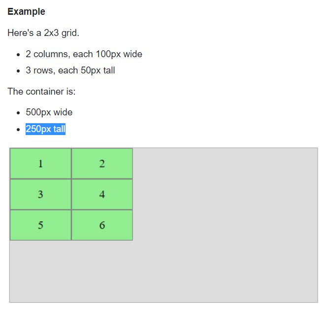

# CSS3 Features

## CSS3 background-size Property

The `background-size` property can be used to specify the size of the background images.

- `cover` tells the browser to make sure the image always covers the entire container, even if it has to stretch the image or cut a little bit off one of the edges.
- `contain` says to always show the whole image, even if that leaves a little space to the sides or bottom.


## CSS3 Text Overflow

Text can overflow, when setting the `white-space:nowrap` property for the containing element.

```css
p {
    width: 400px;
    overflow: hidden;
    white-space: nowrap;
    background: #cdcdcd;
}
p.clipped {
    text-overflow: clip; /* clipped the overflowed text */
}
p.ellipses {
    text-overflow: ellipsis; /* display '…' to represent clipped text */
}
```

## Flexbox

[A Complete Guide to Flexbox](https://css-tricks.com/snippets/css/a-guide-to-flexbox/)


- `display: flex` Generates a block-level flex container.
- `display: inline-flex` Generates an inline flex container similar to inline-block.

**Note**: The `float`, `clear` and `vertical-align` have no effect on a flex item.

### Properties for the Parent (flex container)

```css
.container {
  display: flex; /* or inline-flex */
}
```

```css
.container {
  flex-direction: row | row-reverse | column | column-reverse;
}
```

```css
.container{
  flex-wrap: nowrap | wrap | wrap-reverse;
}
```

```css
.container{
  flex-flow: <‘flex-direction’> || <‘flex-wrap’>
}
/* Default is */
.container{
  flex-flow: row nowrap;
}
```

Align items horizontally.

```css
.container {
  justify-content: flex-start | flex-end | center | space-between | space-around | space-evenly;
}
```

Align items vertically.

```css
.container {
  align-items: stretch | flex-start | flex-end | center | baseline;
}
```

This aligns a flex container’s lines within when there is extra space in the cross-axis.

```css
.container {
  align-content: flex-start | flex-end | center | space-between | space-around | space-evenly | stretch;
}
```

### Properties for the Children (flex items)

```css
.item {
  order: <integer>; /* default is 0 */
}
```

```css
.item {
  flex-grow: <number>; /* default 0 */
}
```

```css
.item {
  flex-shrink: <number>; /* default 1 */
}
```

```css
.item {
  flex-basis: <length> | auto; /* default auto */
}
```

```css
.item {
  flex: none | [ <'flex-grow'> <'flex-shrink'>? || <'flex-basis'> ]
}
```

**Note**: It is recommended that you use the `flex` shorthand property rather than set the individual properties. The shorthand sets the other values intelligently.

```css
.item {
  align-self: auto | flex-start | flex-end | center | baseline | stretch;
}
```

## CSS Grid

[A Complete Guide to Grid](https://css-tricks.com/snippets/css/complete-guide-grid/)

[Why CSS Grid is better than Bootstrap for creating layouts](https://hackernoon.com/how-css-grid-beats-bootstrap-85d5881cf163)

### Justify Content vs. Justify Items

[CSS Grid: Justification and Alignment](https://alligator.io/css/align-justify/)

Make the grid tracks(rows and columns) smaller than the grid container.



The `justify-content` property aligns columns within the container.

**Note** that this property works only when there is free space in the container. If any of the columns were sized with fr, then all free space would be consumed, and `justify-content` would have no effect.


The `justify-items` property aligns grid items within their tracks (not the entire container)


The `justify-self` property overrides `justify-items` on individual items.

