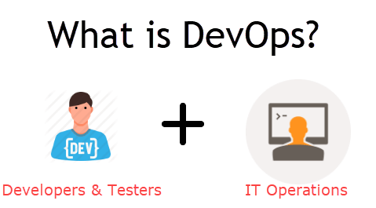
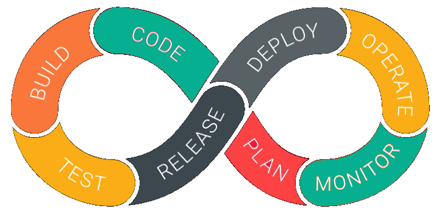

# DevOps

## What is DevOps?

DevOps is a culture which promotes collaboration between Development and Operations Team to deploy code to production faster in an automated & repeatable way. The word 'DevOps' is a combination of two words 'development' and 'operations.'

DevOps helps to increases an organization's speed to deliver applications and services. It allows organizations to serve their customers better and compete more strongly in the market.

In simple words, DevOps can be defined as an alignment of development and IT operations with better communication and collaboration.

## Life-cycle

DevOps is deep integration between development and operations. Understanding DevOps is not possible without knowing DevOps lifecycle.

Here is a brief information about the Continuous DevOps life-cycle:

### 1. Development

In this DevOps stage the development of software takes place constantly. In this phase, the entire development process is separated into small development cycles. This benefits DevOps team to speed up software development and delivery process.

### 2. Testing

QA team use tools like Selenium to identify and fix bugs in the new piece of code.

### 3. Integration

In this stage, new functionality is integrated with the prevailing code, and testing takes place. Continuous development is only possible due to continuous integration and testing.

### 4. Deployment

In this phase, the deployment process takes place continuously. It is performed in such a manner that any changes made any time in the code, should not affect the functioning of high traffic website.

### 5. Monitoring

In this phase, operation team will take care of the inappropriate system behavior or bugs which are found in production.

## Summary

- DevOps is a culture which promotes collaboration between Development and Operations Team to deploy code to production faster in an automated & repeatable way
- Before DevOps operation and Development team working in completed isolation.
- Manual code deployment leads to human errors in production
- In the Old process, Operations team has no clue on the progress of the Development team. So, operations team developed a IT infrastructure purchase and monitoring plan as per their understanding.
- In the DevOps process operation team fully aware of the progress of developer. The purchase and monitoring planning is accurate.
- DevOps offers Maintainability, Predictability, Greater quality cost efficiency and time to market.
- Agile process focuses on functional and non-functional readiness while DevOps focuses on that IT infrastructure aspects.
- DevOps life cycle includes Development, Testing, Integration, Deployment, and Monitoring.
- DevOps engineer will work with development team staff to tackle the coding and scripting needs.
- DevOps engineer should have the soft skill of a problem-solver and be a quick-learner
- DevOps Certifications are available from Amazon web services, Red Hat, Microsoft Academy, DevOps Institute
- DevOps helps organizations in shifting their code deployment cycles to weeks and months instead of years.