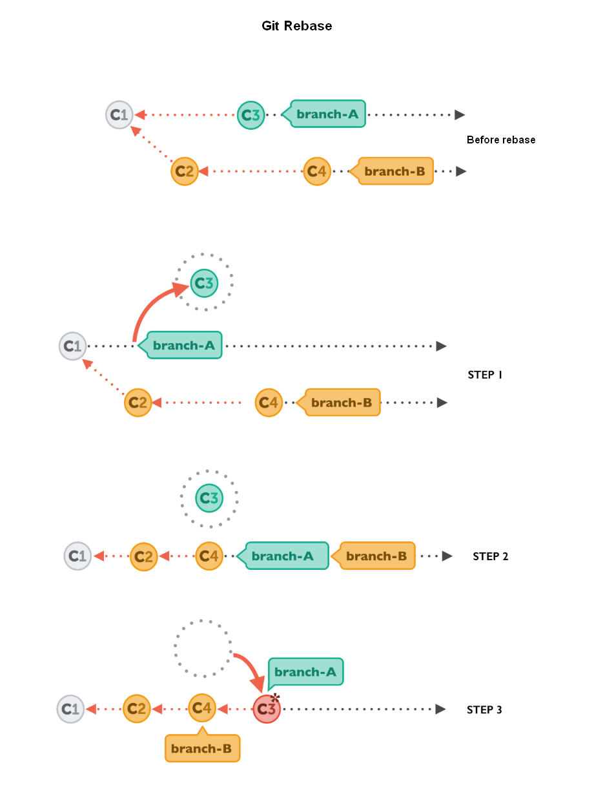

# Git rebase and reset

[Rebase as an Alternative to Merge](https://www.git-tower.com/learn/git/ebook/en/command-line/advanced-topics/rebase)

## Rebase

### What



### Why

在合并过程中, 通过改变提交历史继承关系, 使合并的分支提交历史保持为一条直线.

### How

应用场景:

- 新建一个 **new-feature** 分支用于开发新功能, 并分 **2** 次提交.
- 在 **dev** 分支上也进行一次提交, 比如修复 bug 之类.
- 将 **new-feature** 分支合并到 dev 分支上, 并使提交历史看起来是一条直线

操作步骤:

新建一个 **new-feature** 分支用于开发新功能, 并分 **2** 次提交.

```bash
# 创建一个分支来承接新功能
$ git checkout -b new-feature
Switched to a new branch 'new-feature'

# 实现第1个功能并提交
$ echo "Add new feature in log1" >> log1.txt

$ git commit -am "Add new feature in log1"
The file will have its original line endings in your working directory
[new-feature d15807e] Add new feature in log1
 1 file changed, 1 insertion(+)

# 实现第2个功能并提交
$ echo "Add new feature in log2" > log2.txt
$ git add log2.txt
$ git commit -m "Add new feature in log2"
[new-feature 1f399e6] Add new feature in log2
 1 file changed, 1 insertion(+)
 create mode 100644 log2.txt

# 查看目前提交的历史
$ git log --oneline --graph
* 1f399e6 (HEAD -> new-feature) Add new feature in log2
* d15807e Add new feature in log1
* 6290e23 (tag: v0.2, origin/dev, dev) Ignore idea dir
* 5b9118e (tag: v0.1) Add log1
* b6a6590 (origin/master, origin/HEAD, master) Initial commit
```

在 **dev** 分支上也进行一次提交, 比如修复 bug 之类.

```bash
$ git checkout dev
$ echo "Fixed a minor issue" > README.md
$ git commit -am "Squish a bug"
The file will have its original line endings in your working directory
[dev 4d5c35d] Squish a bug
 1 file changed, 1 insertion(+), 3 deletions(-)
```

在 dev 分支上打一个标签(Annotated Tag)记录下修复 bug 后的版本:

```bash
$ git tag -a v0.3 -m "Improved stability"

$ git show v0.3
tag v0.3
Tagger: username <username@mail.com>
Date:   Tue Mar 10 11:46:57 2020 +0800

Improved stability
```

此时 dev 分支的提交历史看起来是这样的:

```bash
$ git log --oneline --graph
* 4d5c35d (HEAD -> dev, tag: v0.3) Squish a bug
* 6290e23 (tag: v0.2, origin/dev) Ignore idea dir
* 5b9118e (tag: v0.1) Add log1
* b6a6590 (origin/master, origin/HEAD, master) Initial commit
```

在开发新功能的同时, dev 分支也发生了变化, 所以需要先把 dev 分支的变化 `rebase` 到 new-feature 分支上:

```bash
# 切换到 dev 分支准备下一步操作
$ git checkout new-feature
Switched to branch 'new-feature'

# 将 dev 分支的改动 rebase 到 new-feature 上
$ git rebase dev
First, rewinding head to replay your work on top of it...
Applying: Add new feature in log1
Applying: Add new feature in log2

# rebase 后的 new-feature 是站在了最新的 dev 上的(包含了 dev 分支的改动)
$ git log --oneline --graph
* d2d48d2 (HEAD -> new-feature) Add new feature in log2
* e96afa2 Add new feature in log1
* 4d5c35d (tag: v0.3, dev) Squish a bug
* 6290e23 (tag: v0.2, origin/dev) Ignore idea dir
* 5b9118e (tag: v0.1) Add log1
* b6a6590 (origin/master, origin/HEAD, master) Initial commit
```

注意: `rebase` 后 **new-feature** 提交历史的继承关系会发生变化. (由 *6290e23* 变成了 *4d5c35d*)

由于此时的 **new-feature** 已经包含了 dev 分支上的最新修改, 所以再合并到 dev 上时不会造成冲突:

```bash
$ git checkout dev
Switched to branch 'dev'

$ git merge new-feature
Updating 4d5c35d..d2d48d2
Fast-forward
 log1.txt | 1 +
 log2.txt | 1 +
 2 files changed, 2 insertions(+)
 create mode 100644 log2.txt
```

从提交历史上看, 此时的 dev 分支是从 v0.3 版本的基础上又进行了 2 次提交(d2d48d2, e96afa2) 而进化来的.

通过 `rebase` 这种方式进行合并时提交历史看起来是一条直线, 而不会出现多余的 merge commit.

```bash
$ git log --oneline --graph
* d2d48d2 (HEAD -> dev, new-feature) Add new feature in log2
* e96afa2 Add new feature in log1
* 4d5c35d (tag: v0.3) Squish a bug
* 6290e23 (tag: v0.2, origin/dev) Ignore idea dir
* 5b9118e (tag: v0.1) Add log1
* b6a6590 (origin/master, origin/HEAD, master) Initial commit
```

### Pitfalls

在执行 `git rebase` 时, 会改变当前分支提交历史的继承关系, 所以建议在 **feature** 分支上进行 `rebase` 操作. 而不是直接在 **dev** 分支上进行 `rebase` 操作. 从而避免 dev 分支提交历史的改变, 导致无法回退. 这样操作也可以解释为, 在 **feature** 分支上, 先包含了最新 **dev** 分支的改动后再继续工作.

另外由于 `rebase` 会修改提交历史, 所以应该避免在公共的分支上, 特别是已发布的分支上执行 `rebase` 操作, 否则会引起因为提交历史被修改导致的无法合并或无法回退的风险.

### Try it yourself

上述操作如果换成直接在 **dev** 分支上 `rebase` 会出现什么情况?

### Merge vs Squash vs Rebase

- **Merge** 会保留所有提交的历史, 会多生成一次提交来记录两个分支的差异, 不会改变历史
- **Squash Merge** 会将多次提交历史合并为一次, 并会丢弃原始提交的信息, 不会改变历史
- **Rebase** 会保留提交历史, 但是会改变提交历史节点的关系

## Reset

### Amend last commit

在提交时如果忘记了部分文件, 或者提交信息有笔误, 但又不想通过再提交 1 次来修改之前的马虎怎么办?
`--amend` 选项可以化解这种尴尬:

需要实现2个功能, (...但是实际上只实现了1个功能就匆忙提交了)

```bash
$ echo "## Add new feature1" >> README.md
$ git commit -am "Implement both feature 1 and 2"
The file will have its original line endings in your working directory
[dev f289857] Implement both feature 1 and 2
 1 file changed, 1 insertion(+)
```

Oops ! 这么专业的我居然漏掉了功能2就提交了, 赶紧把漏掉的功能补上:

```bash
$ echo "## Add new feature2" >>  README.md
$ git add .
$ git commit -m "Forget to implement feature 2"
...
```

不行这样操作会留下新的提交历史,
听说 `--amend` 这个选项很厉害能修改最后一次提交历史而不被人发现,
后面不加 `-m` 会自动弹出 vim 编辑器带出上一次提交消息,
当然在 vim 编辑器里也可以对上一次的提交消息再次进行编辑:

```bash
$ echo "## Add new feature2" >>  README.md
$ git add .
$ git commit --amend
[dev 8ac9d08] Implement both feature 1 and 2
 Date: Tue Mar 10 14:21:44 2020 +0800
 1 file changed, 2 insertions(+)
```

搞定, 神不知鬼不觉, 不愧是我 :D

### Reset file

使用 `git checkout HEAD file/to/restore` 将文件回退到当前最后一次的提交状态:

```bash
$ echo "mess something up" >> log1.txt
$ git checkout HEAD log1.txt
Updated 1 path from dcd464d
```

### Reset Commit history

如果工作区对多个文件做了修改, 此时想回退到未修改前的状态, 也就是最新一次提交的状态,
可以使用:

```bash
git reset --hard HEAD
```

这里的 `HEAD` 也可以换成具体的提交历史的ID(commit hash), 来回退到指定的之前的某一个版本(状态)

```bash
git reset --hard 5b9118e
```

或者回退到 `HEAD` 之前的n个历史:

```bash
git reset --hard HEAD~2
```

### hard vs soft vs mixed

在使用 reset 回退历史时, 可以加入以下几参数:

```bash
git reset [--hard, --soft, --mixed(default)]
```

区别:

- `--mixed`(默认): 撤销提交, 并保留提交中涉及到的修改, 并回退到指定版本
- `--hard`: 撤销提交, 丢掉所有改动, 并回退到指定版本
- `--soft`: 撤销提交, 将提交中涉及到的改动加到暂存区(staging area or index), 并回退到指定版本

----
Done

Tips: `code` = `co`ffee + `de`veloper

所以刻苦学习的同时也别忘了休息呀.
