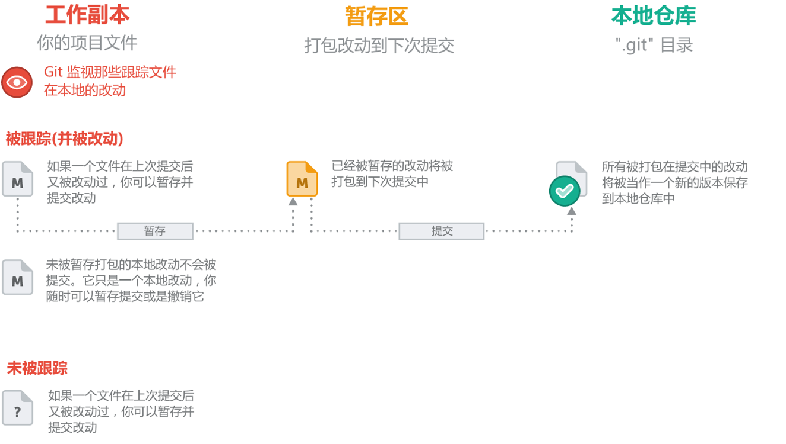

# 仓库

Version Control System 版本控制系统

## 概念

**工作副本**：本地项目代码，git监视那些跟踪文件在你本地的改动  

**Staging Area**：暂存区，加入暂存区的文件状态为track状态，未加入暂存区的文件状态为 untracked

**Local Repository**：本地仓库  

**Remote Repository**：远程仓库

## 文件状态



## git 命令

- 创建本地仓库`git init`

```bash
$ git init test
Initialized empty Git repository in /path/to/your/repo/
```

- 创建远程仓库

    在git上创建远程仓库，获取远程仓库地址('http://xxx.xx.com/xxxx/xxx.git')

- 查看远程仓库

```bash
git remote -v
```

- 将本地仓库和远程仓库地址关联

```bash
git remote add origin http://xxx.xx.com/xxxx/xxx.git
```

- 将工作副本中的文件上传到暂存区`git add .`（add所有文件）或`git add 1.log`

```bash
$ git add .
warning: LF will be replaced by CRLF in 1.log.
The file will have its original line endings in your working directory
```

- 提交到本地仓库`git commit -m "instruction"`

```bash
$ git commit -m "Commit code to local reporsity"
[master (root-commit) 96b8a42] Commit code to local reporsity
 1 file changed, 1 insertion(+)
 create mode 100644 1.log
```

- 查看提交日志`git log`

```bash
$ git log
commit 96b8a42c284914d806ff863e8d295cca4fa49662 (HEAD -> master)
Author: username <useremail@mail.com>
Date:   Tue Mar 10 21:22:24 2020 +0800

    Commit code to local repository
```

q退货查看

- 提交代码到远程仓库`git push -u origin master`

```bash
$ git push -u origin master
Enumerating objects: 3, done.
Counting objects: 100% (3/3), done.
Delta compression using up to 4 threads
Compressing objects: 100% (2/2), done.
Writing objects: 100% (3/3), 213 bytes | 213.00 KiB/s, done.
Total 3 (delta 0), reused 0 (delta 0)
To http:/github.com/username/repo.git
 * [new branch]      master -> master
Branch 'master' set up to track remote branch 'master' from 'origin'.
```

- 从远程仓库克隆代码

```bash
$ git clone http:/github.com/username/repo.git
Cloning into 'repo'...
warning: You appear to have cloned an empty repository.
```

- 从远程仓库拉取代码`git pull`
  
```bash
$ git pull
Already up to date.
```

- 查看提交状态`git status`

```bash
$ git status
On branch master
Your branch is up to date with 'origin/master'.

nothing to commit, working tree clean
```
