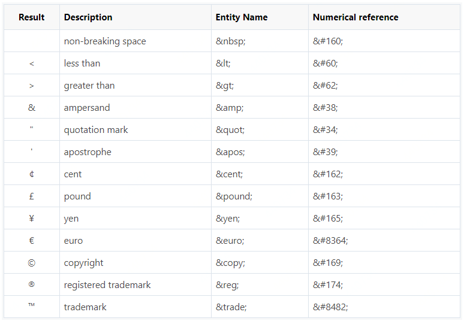
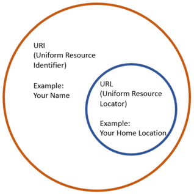

# HTML Tutorial

## The Right Tools

- [VSCode - Code editing Redefined](https://code.visualstudio.com/)
- [Emmet — the essential toolkit for web-developers](https://emmet.io/)

## Install Useful VSCode Extensions

Refer to the [vscode extension doc](../tools/vscode-extensions.md)

## The Tutorial

Follow [this](https://www.tutorialrepublic.com/html-tutorial/) tutorial

## HTML Tags Vs Elements

- Elements: HTML element is the collection of start tag, its attributes, an end tag and everything in between
- Tags: HTML tag (either opening or closing) is used to mark the start or end of an element

## Empty HTML Elements

Empty elements (also called self-closing or void elements) are not container tags.

A typical example of an empty element, is the `<br>` element, which represents a line break. Some other common empty elements are ``, `<input>`, `<link>`, `<meta>`, `<hr>`, etc.

**Note**: In HTML, a self-closing element is written simply as `<br>`. In XHTML, a self-closing element requires a space and a trailing slash, such as `<br />`.

## HTML Element Types

- block level: A block element occupies 100% of the available width and it is rendered with a line break before and after
- inline level: An inline element will take up only as much space as it needs

## Element Attributes

Single quotes and double quotes

Both single and double quotes can be used to quote attribute values. However, **double** quotes are most common. In situations where the attribute value itself contains double quotes it is necessary to wrap the value in single quotes, e.g., `value='John "Williams" Jr.'`

Boolean attributes

There are several attributes in HTML5 that do not consist of name/value pairs but consists of just name. Such attributes are called **Boolean attributes**. Examples of some commonly used Boolean attributes are `checked`, `disabled`, `readonly`, `required`, etc.

Value case-insensitive

World Wide Web Consortium (W3C) recommends lowercase for attributes values in their specification.

## Managing White Spaces

The browser will treat multiple line breaks and white spaces as one.

- Insert `&nbsp;` for creating extra consecutive spaces
- Insert `<br>` tag for creating line breaks

## Serif vs Sans Serif fonts

The small features on the ends of strokes in some fonts are known as “Serifs.”

Some common **Serif** typefaces are `Times New Roman`, `Georgia`, `Palatino and Garamond`.
In contrast, common **Sans Serif** typefaces include `Arial`, `Helvetica` and `Tahoma`. Read more in [this](https://about.easil.com/support/serif-vs-sans-serif/) post.


## Adding Styles to HTML Elements

- Inline styles — Using the `style` attribute in the HTML start tag.
- Embedded style — Using the `<style>` element in the `head` section of the document.
- External style sheet — Using the `<link>` element, pointing to an external CSS files.

Priority: inline > embedded > external

## Importing External Style Sheets

The `@import` statement instructs the browser to load an external style sheet and use its styles.

```html
<style>
    @import url("css/style.css");
    p {
        color: blue;
        font-size: 16px;
    }
</style>
```

Similarly, you can use the `@import` rule to import a style sheet within another style sheet.

```css
@import url("css/layout.css");
@import url("css/color.css");
body {
    color: blue;
    font-size: 14px;
}
```

**Note**: All `@import` rules must occur at the start of the style sheet. Any style rule defined in the style sheet itself override conflicting rule in the imported style sheets. The `@import` rule may cause performance issues, you should generally avoid importing style sheets.

## HTML5 Structural Elements

HTML5 has introduced the new structural elements such as `<header>`, `<footer>`, `<nav>`, `<section>`, etc. to define the different parts of a web page in a more semantic way.

You can consider these elements as a replacement for commonly used classes such as `.header`, `.footer`, `.nav`, `.section`, etc.

## Embedded and External JavaScript

Ideally, script elements should be placed at the bottom of the page, before the closing body tag i.e. `</body>`, because when browser encounters a script it pauses rendering the rest of the page until it parses the script that may significantly impact your site performance.

**Note**: When the src attribute is specified, the `<script>` element must be empty. This simply means that you cannot use the same `<script>` element to both embed the JavaScript and to link to an external JavaScript file in an HTML document.

## Entities



## URI vs URL



- A URI is an identifier of a specific resource. Like a page, or book, or a document.
- A URL is special type of identifier that also tells you how to access it, such as *HTTPs*, *FTP*, etc. like <https://www.google.com>.

Read [this](https://www.guru99.com/url-vs-uri-difference.html) post for detailed explanation.

## Web Storage

- Local storage — The local storage uses the `localStorage` object to store data for your entire website on a permanent basis. That means the stored local data will be available on the next day, the next week, or the next year unless you remove it.
- Session storage — The session storage uses the `sessionStorage` object to store data on a temporary basis, for a single browser window or tab. The data disappears when session ends i.e. when the user closes that browser window or tab.

Available methods:

```javascript
localStorage.setItem(key, value);
localStorage.getItem(key);
localStorage.removeItem(key);
localStorage.clear();
```

**Note**: The web storage data (both `localStorage` and `sessionStorage`) will not be available between different browsers.

## Application Cache

HTML5 introduces an application cache mechanism that allows the browser to automatically save the HTML file and all the other resources that needs to display it properly on the local machine, so that the browser can still access the web page and its resources without an internet connection.

- **Offline browsing** — Users can use the application even when they're offline or there are unexpected disruptions in the network connection.
- **Improve performance** — Cached resources load directly from the user's machine rather than the remote server hence web pages load faster and performing better.
- **Reduce HTTP request and server load** — The browser will only have to download the updated/changed resources from the remote server that minimize the HTTP requests and saves precious bandwidth as well as reduce the load on the web server.

```manifest
CACHE MANIFEST
# v1.0 : 10-08-2014

CACHE:
# pages
index.html

# styles & scripts
css/theme.css
js/jquery.min.js
js/default.js

# images
/favicon.ico
images/logo.png

NETWORK:
login.php

FALLBACK:
/ /offline.html
```

- **CACHE**: Explicitly cached after they're downloaded for the first time.
- **NETWORK**: White-listed resources that are never cached and aren't available offline.
- **FALLBACK**: Fallback URIs the browser should use in case the connection to the server cannot be established.

**NOTE**: Both URIs must be from the same origin as the manifest file.

Enable manifest file

```html
<html lang="en" manifest="example.appcache">
```
