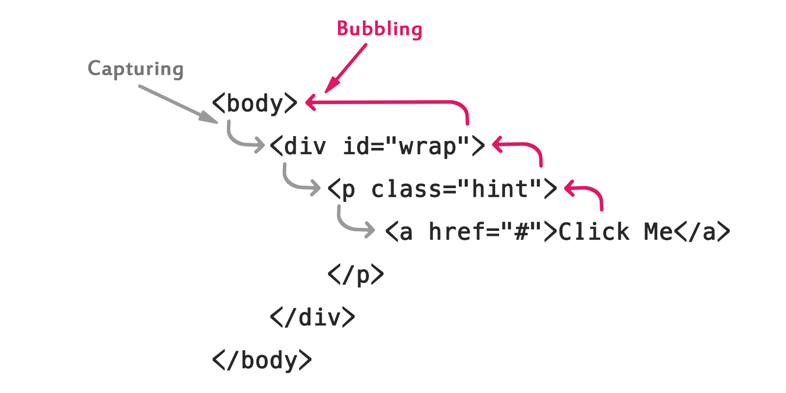

# DOM Related

## Positioning of Script inside HTML Document

The `<script>` element can be placed in the `<head>`, or `<body>` section of an HTML document. But ideally, scripts should be placed at the end of the body section, just before the closing `</body>` tag, it will make your web pages load faster, since it prevents obstruction of initial page rendering.

Each `<script>` tag blocks the page rendering process until it has fully downloaded and executed the JavaScript code, so placing them in the head section of the document without any valid reason will significantly impact your website performance.

**Tip**: You can place any number of `<script>` element in a single document. However, they are processed in the order in which they appear in the document, from top to bottom.

## Event Propagation

Event capturing only works with event handlers registered with the `addEventListener()` method when the third argument is set to true. The traditional method of assigning event handlers, like using `onclick`, `onmouseover`, etc. won't work here.

Event bubbling is supported in all browsers, and it works for all handlers, regardless of how they are registered e.g. using `onclick` or `addEventListener()` (unless they are registered as capturing event listener). That's why the term event propagation is often used as a synonym of event bubbling.

To prevent this situation you can stop event from bubbling up the DOM tree using the `event.stopPropagation()` method.

Additionally, you can even prevent any other listeners attached to the same element for the same event type from being executed using the `stopImmediatePropagation()` method.

**Note**: If several listeners are attached to the same element for the same event type, they are executed in order in which they have been added. But, if any listener calls the `event.stopImmediatePropagation()` method, no remaining listeners will be executed.

## Preventing the Default Action

Some events have a default action associated with them. For example, if you click on a link browser takes you to the link's target, when you click on a form submit button browser submit the form, etc. You can prevent such default actions with the `preventDefault()` method of the event object.
