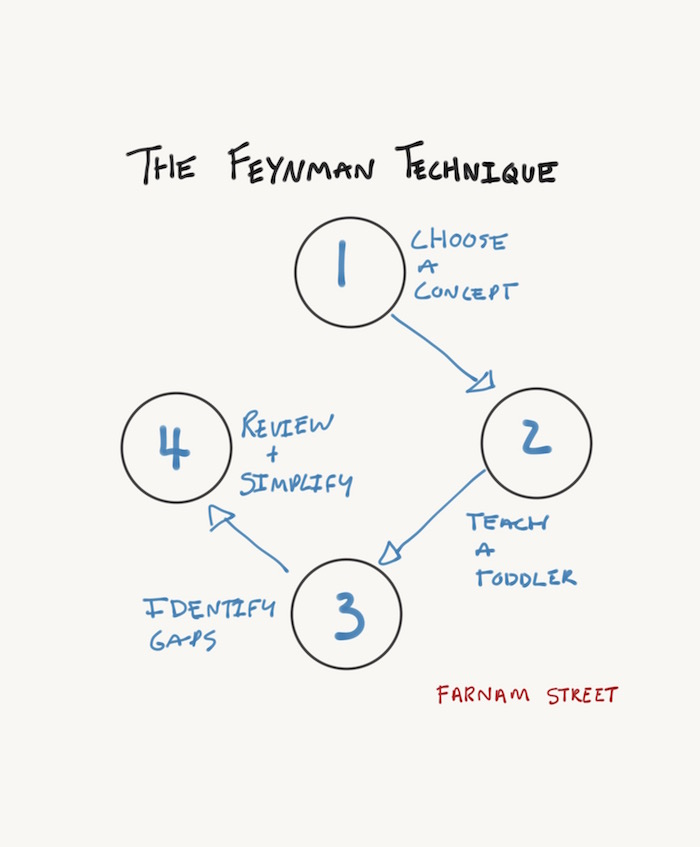

# The Feynman Technique: The Best Way to Learn Anything

Created: May 13, 2019 11:12 AM
URL: <https://fs.blog/2012/04/feynman-technique/>

There are four simple steps to **the Feynman Technique**, which I’ll explain below:

1. Choose a Concept
2. Teach it to a Toddler
3. Identify Gaps and Go Back to The Source Material
4. Review and Simplify (optional)

If you’re not learning you’re standing still. So what’s the best way to learn new subjects and identify gaps in our existing knowledge?

## Two Types of Knowledge

There are [two types of knowledge](https://fs.blog/2015/09/two-types-of-knowledge/) and most of us focus on the wrong one. The first type of knowledge focuses on knowing the name of something. The second focuses on knowing something. These are not the same thing. The famous Nobel winning physicist **[Richard Feynman](https://fs.blog/richard-feynman/)** understood [the difference between knowing something and knowing the name of something](https://fs.blog/2015/01/richard-feynman-knowing-something/) and it’s one of the most important reasons for his success. In fact, he created **a formula for learning** that ensured he understood something better than everyone else.

It’s called the Feynman Technique and it will help you learn anything faster and with greater understanding. Best of all, it’s incredibly easy to implement.

> The person who says he knows what he thinks but cannot express it usually does not know what he thinks.
> — Mortimer Adler

There are four steps to the Feynman Technique.

### Step 1: Teach it to a child

Take out a blank sheet of paper and write the subject you want to learn at the top. Write out what you know about the subject as if you were teaching it to a child. Not your smart adult friend but rather an 8-year-old who has just enough vocabulary and attention span to understand basic concepts and relationships.

A lot of people tend to use complicated vocabulary and jargon to mask when they don’t understand something. The problem is we only fool ourselves because we don’t know that we don’t understand. In addition, using jargon conceals our misunderstanding from those around us.

When you write out an idea from start to finish in simple language that a child can understand (tip: use only the most common words), you force yourself to understand the concept at a deeper level and simplify relationships and connections between ideas. If you struggle, you have a clear understanding of where you have some gaps. That tension is good, it heralds an opportunity to learn.

### Step 2: Review

In step one, you will inevitably encounter gaps in your knowledge where you’re forgetting something important, are not able to explain it, or simply have trouble connecting an important concept. This is invaluable feedback because you’ve discovered the edge of your knowledge. Competence is knowing the limit of your abilities, and you’ve just identified one! This is where the learning starts. Now you know where you got stuck, go back to the source material and re-learn it until you can explain it in basic terms. Identifying the boundaries of your understanding also limits the mistakes you’re liable to make and increases your chance of success when applying knowledge.

### Step 3: Organize and Simplify

Now you have a set of hand-crafted notes. Review them to make sure you didn’t mistakenly borrow any of the jargon from the source material. Organize them into a simple story that flows. Read them out loud. If the explanation isn’t simple or sounds confusing that’s a good indication that your understanding in that area still needs some work.

### Step 4 (optional): Transmit

If you really want to be sure of your understanding, run it past someone (ideally who knows little of the subject –or find that 8-year-old!). The ultimate test of your knowledge is your capacity to convey it to another.

## Conclusion

Not only is this a wonderful recipe for learning but it’s also a window into a different way of thinking that allows you to tear ideas apart and reconstruct them from the ground up. (Elon Musk calls this [thinking from first principles](https://fs.blog/2015/04/elon-musk-framework-thinking/).) This leads to a much deeper understanding of the ideas and concepts. Importantly, approaching problems in this way allows you to understand when others don’t know what they are talking about.

Feynman’s approach intuitively believes that intelligence is a process of growth, which dovetails nicely with the work of Carol Dweck, who beautifully describes [the difference between a fixed and growth mindset](https://fs.blog/2015/03/carol-dweck-mindset/).
